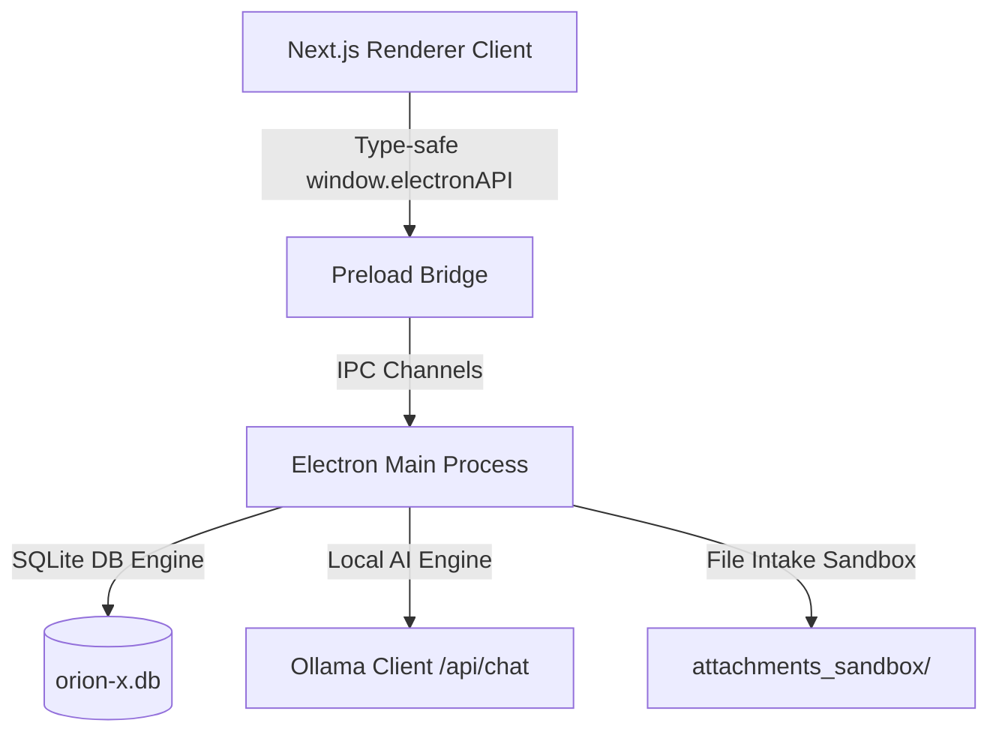

# ORION-X Master Technical Blueprint: Complete System Architecture (V1.0)

This master document details the complete architectural topology, database schema relations, IPC communication bridges, and animation pipelines of **ORION-X Studio**, a premium space-themed desktop operating system for AI workspaces.

---

## 1. Executive System Summary

ORION-X Studio is designed as a hybrid desktop environment combining a secure, local-first Electron main process with a high-fidelity Next.js React App Router frontend. 

The architecture maintains strict environment isolation, sandboxing all file execution, database storage, and AI inference calls inside the Electron main process. The frontend operates inside a secured, non-node-integrated environment, communicating with native services exclusively through a white-listed Inter-Process Preload Bridge. 



---

## 2. Folder & Code Topology

```markdown
orion-x-studio/
├── electron-builder.json           # Standalone packaging configurations
├── package.json                    # Monorepo workspace configuration & target task scripts
├── main/
│   ├── tsconfig.json               # Main process compilation targets (CommonJS)
│   └── src/
│       ├── index.ts                # Application lifecycle entry & BrowserWindow creation
│       ├── preload.ts              # Secured ContextIsolated Preload Bridge
│       ├── config/
│       │   └── SystemConfig.ts     # Path resolvers for application caches & AppData
│       ├── core/
│       │   └── BootstrapEngine.ts  # Startup folder audits & SQLite initiation sequence
│       ├── database/
│       │   ├── DatabaseEngine.ts   # SQLite connection manager & transactional wrappers
│       │   └── schemas.ts          # Relational tables schemas (settings, threads, messages, attachments, chunks)
│       ├── ipc/
│       │   ├── ChatIPC.ts          # Low-latency prompt submission & event emitters
│       │   ├── FileIPC.ts          # Attachment ingests & metadata queries
│       │   ├── KnowledgeIPC.ts     # Document indexing & chunk query bindings
│       │   ├── LocalAIIPC.ts       # Model listings & direct Ollama streaming proxies
│       │   ├── SettingsIPC.ts      # Global configurations getters/setters handles
│       │   └── WorkspaceIPC.ts     # Threads & messages workspace CRUD mappings
│       └── services/
│           ├── ChatOrchestrator.ts # Atomic prompt orchestrator (user log -> AI stream -> assistant log)
│           ├── FileIngestor.ts     # Sandboxed file duplicator & unique hash generator
│           ├── KnowledgeEngine.ts  # Sliding-window document chunking parser
│           ├── LocalAIEngine.ts    # Asynchronous Ollama fetch stream decoder
│           ├── SettingsRegistry.ts # JSON serialized configuration mapper
│           └── WorkspaceManager.ts # Parameterized workspace SQLite queries
└── renderer/
    ├── next.config.mjs             # Next.js static HTML export parameters configuration
    ├── package.json                # Next.js configurations & styles package dependencies
    └── src/
        ├── app/
        │   ├── layout.tsx          # Provider bindings & font mappings
        │   └── page.tsx            # Context-state app switcher (Splash -> Home -> Workspace)
        ├── context/
        │   └── AppContext.tsx      # Main application state machine & IPC hydration hooks
        ├── hooks/
        │   └── useLocalStorage.ts  # Hydration-safe browser local storage fallback utility
        ├── styles/
        │   └── globals.css         # Styling directives, selection overrides, scrollbar tweaks
        ├── types/
        │   └── electron.d.ts       # Precise window.electronAPI global type definitions
        └── components/
            ├── chat/
            │   ├── ChatContainer.tsx # Message feed scroller, thinking loaders, layout grids
            │   ├── ChatInput.tsx   # Textareas auto-grow, file upload listeners, drag overlays
            │   ├── ChatMessage.tsx # Markdown renderer & Prism Code highlighting wraps
            │   ├── CodeBlock.tsx   # Copy-to-clipboard blocks
            │   └── FilePreview.tsx # transclucent capsule indicators for attached uploads
            ├── home/
            │   ├── GlassFolder.tsx # Opening animation trigger
            │   └── HomeScreen.tsx  # Centralized directory dashboard
            ├── settings/
            │   └── SettingsModal.tsx # Glass panel configuration panel
            ├── sidebar/
            │   └── ProjectSidebar.tsx # Active threads manager & Settings gear trigger
            ├── ui/
            │   └── Spinner.tsx     # Animated SVG loader rings
            └── workspace/
                ├── NeuralNodes.tsx # 30 floating canvas nodes background simulator
                └── WorkspaceLayout.tsx # Three-column slide-in desktop grid
```

---

## 3. Detailed System Analysis

### System 1: Application Bootstrap
- **Location**: [SystemConfig.ts](file:///C:\Users\asus/.gemini/antigravity/scratch/orion-x-studio/main/src/config/SystemConfig.ts) & [BootstrapEngine.ts](file:///C:\Users\asus/.gemini/antigravity/scratch/orion-x-studio/main/src/core/BootstrapEngine.ts)
- **Mechanics**: Computes system-appropriate workspace storage paths. On Windows, it maps to `C:\Users\<user>\AppData\Roaming\OrionXStudio`. `BootstrapEngine` verifies write access asynchronously using directory checks and a quick file read/write sequence (`.orion_boot_session`), failing startup if paths are locked or read-only.

### System 2: Database Engine Setup
- **Location**: [DatabaseEngine.ts](file:///C:\Users\asus/.gemini/antigravity/scratch/orion-x-studio/main/src/database/DatabaseEngine.ts) & [schemas.ts](file:///C:\Users\asus/.gemini/antigravity/scratch/orion-x-studio/main/src/database/schemas.ts)
- **Mechanics**: Singleton SQLite handle utilizing native drivers. Enforces `PRAGMA foreign_keys = ON;` immediately on connection. Registers five relational tables: `settings`, `threads`, `messages`, `attachments`, and `document_chunks`. Table `messages` references `threads(id) ON DELETE CASCADE`, and `attachments` references `messages(id) ON DELETE CASCADE`.

### System 3: Configuration & Settings Registry
- **Location**: [SettingsRegistry.ts](file:///C:\Users\asus/.gemini/antigravity/scratch/orion-x-studio/main/src/services/SettingsRegistry.ts) & [SettingsIPC.ts](file:///C:\Users\asus/.gemini/antigravity/scratch/orion-x-studio/main/src/ipc/SettingsIPC.ts)
- **Mechanics**: Exposes transactional `get(key, defaultValue)` and `set(key, value)` channels. Values are serialized to JSON strings on insert. Utilizes an `UPSERT` command query to update existing values: `INSERT INTO settings (keys, value) VALUES (?, ?) ON CONFLICT(keys) DO UPDATE SET value = EXCLUDED.value;`.

### System 4: Multi-Thread Workspace Engine
- **Location**: [WorkspaceManager.ts](file:///C:\Users\asus/.gemini/antigravity/scratch/orion-x-studio/main/src/services/WorkspaceManager.ts) & [WorkspaceIPC.ts](file:///C:\Users\asus/.gemini/antigravity/scratch/orion-x-studio/main/src/ipc/WorkspaceIPC.ts)
- **Mechanics**: Implements parameterized workspace SQLite queries. Thread deletion utilizes the SQLite cascading rules to erase all child messages and attachments automatically. Message timestamps are resolved to integer milliseconds (`Date.now()`).

### System 5: Local AI Engine Runtime
- **Location**: [LocalAIEngine.ts](file:///C:\Users\asus/.gemini/antigravity/scratch/orion-x-studio/main/src/services/LocalAIEngine.ts) & [LocalAIIPC.ts](file:///C:\Users\asus/.gemini/antigravity/scratch/orion-x-studio/main/src/ipc/LocalAIIPC.ts)
- **Mechanics**: Establishes connections to local Ollama endpoints (defaulting to `http://localhost:11434`). Queries models lists at `/api/tags` and proxies inference requests to `/api/chat`. Uses Node's `fetch` streaming body to read chunks, decoding lines with `TextDecoder` and executing parsing callbacks.

### System 6: Central Chat Routing Engine
- **Location**: [ChatOrchestrator.ts](file:///C:\Users\asus/.gemini/antigravity/scratch/orion-x-studio/main/src/services/ChatOrchestrator.ts) & [ChatIPC.ts](file:///C:\Users\asus/.gemini/antigravity/scratch/orion-x-studio/main/src/ipc/ChatIPC.ts)
- **Mechanics**: Orchestrates message delivery. Commits the user message to SQLite, compiles the thread's message history as the LLM context, and starts streaming tokens from `LocalAIEngine`. Chunks are written to memory and immediately forwarded to the client. Upon stream completion, the full response is written to the database under a new assistant message ID.

### System 7: Local File Intake Pipeline
- **Location**: [FileIngestor.ts](file:///C:\Users\asus/.gemini/antigravity/scratch/orion-x-studio/main/src/services/FileIngestor.ts) & [FileIPC.ts](file:///C:\Users\asus/.gemini/antigravity/scratch/orion-x-studio/main/src/ipc/FileIPC.ts)
- **Mechanics**: Initializes a protected `attachments_sandbox` folder. Dragged files are copied asynchronously into this sandbox using `fs/promises.copyFile` and assigned a collision-free filename hashed with random bytes. Metadata is logged in the `attachments` table.

### System 8: Local Memory & Knowledge Engine
- **Location**: [KnowledgeEngine.ts](file:///C:\Users\asus/.gemini/antigravity/scratch/orion-x-studio/main/src/services/KnowledgeEngine.ts) & [KnowledgeIPC.ts](file:///C:\Users\asus/.gemini/antigravity/scratch/orion-x-studio/main/src/ipc/KnowledgeIPC.ts)
- **Mechanics**: Implements character-based sliding-window document chunking. Reads file text using `fs/promises.readFile`, slicing the text into 500-character segments with a 100-character step overlap. A metadata index block is serialized to JSON and stored with the chunk in `document_chunks`.

### System 9: Inter-Process Preload Bridge
- **Location**: [preload.ts](file:///C:\Users\asus/.gemini/antigravity/scratch/orion-x-studio/main/src/preload.ts) & [electron.d.ts](file:///C:\Users\asus/.gemini/antigravity/scratch/orion-x-studio/renderer/src/types/electron.d.ts)
- **Mechanics**: Exposes `window.electronAPI` inside the isolated context of the browser, mapping settings, workspace operations, chat handlers, and file ingests. Emits events for streaming responses and includes unmount cleanup listeners.

### System 10: State Hydration & UI Integration
- **Location**: [AppContext.tsx](file:///C:\Users\asus/.gemini/antigravity/scratch/orion-x-studio/renderer/src/context/AppContext.tsx)
- **Mechanics**: Serves as the central React client state machine. On mount, it hydrates settings, models, and threads with messages and attachments by querying the SQLite database. Updates states dynamically for user messages, placeholder assistants, and streaming tokens.

### System 11: UI Presentation & Sci-Fi Aesthetics
- **Location**: [globals.css](file:///C:\Users\asus/.gemini/antigravity/scratch/orion-x-studio/renderer/src/styles/globals.css), [HomeScreen.tsx](file:///C:\Users\asus/.gemini/antigravity/scratch/orion-x-studio/renderer/src/components/home/HomeScreen.tsx), [WorkspaceLayout.tsx](file:///C:\Users\asus/.gemini/antigravity/scratch/orion-x-studio/renderer/src/components/workspace/WorkspaceLayout.tsx) & [NeuralNodes.tsx](file:///C:\Users\asus/.gemini/antigravity/scratch/orion-x-studio/renderer/src/components/workspace/NeuralNodes.tsx)
- **Mechanics**: Implements a premium glassmorphic dark theme. Features a 30-node floating particle canvas in the background. On click, the workspace folder triggers a hardware-accelerated scale-125 transition. Panels glide in on mount using slide-in animations.

### System 12: Production Packaging Pipeline
- **Location**: [electron-builder.json](file:///C:\Users\asus/.gemini/antigravity/scratch/orion-x-studio/electron-builder.json), [package.json](file:///C:\Users\asus/.gemini/antigravity/scratch/orion-x-studio/package.json) & [next.config.mjs](file:///C:\Users\asus/.gemini/antigravity/scratch/orion-x-studio/renderer/next.config.mjs)
- **Mechanics**: Next.js is configured for static export mode (`output: 'export'`) with unoptimized images. `electron-builder` packages the static output and compiled main process code into a single-file NSIS installer.

---

## 4. Version 2 Landing Ports (AI Girl Readiness Matrix)

To enable plug-and-play scaling for Version 2 modules (3D avatar integration, voice synthesizers, real-time lip-sync, and emotion processing), the codebase has been decoupled at the following landing points:

### A. 3D WebGL Canvas Injection
- **Port Location**: [WorkspaceLayout.tsx](file:///C:\Users\asus/.gemini/antigravity/scratch/orion-x-studio/renderer/src/components/workspace/WorkspaceLayout.tsx#L53-L65)
- **Details**: The right context panel (fixed at `300px`) is currently isolated as a placeholder. In V2, a three.js/WebGL canvas container can be mounted directly into this slot. It is isolated from the chat window grid, preventing canvas re-renders when messages mutate.

### B. Speech Synthesis & Streaming Voice Hooks
- **Port Location**: [AppContext.tsx](file:///C:\Users\asus/.gemini/antigravity/scratch/orion-x-studio/renderer/src/context/AppContext.tsx#L104-L125)
- **Details**: The `chat.onChunk` listener in the React context is the exact entry point for speech synthesis. Audio processors can tap into this streaming callback to feed token fragments directly to a Web Audio API synthesizer, enabling low-latency real-time text-to-speech.

### C. Lip-Sync & Viseme Event Pipelines
- **Port Location**: [preload.ts](file:///C:\Users\asus/.gemini/antigravity/scratch/orion-x-studio/main/src/preload.ts#L22-L42)
- **Details**: The preload bridge exposes clean event listeners. In V2, a new `chat:visemes` or `audio:stream` channel can be exposed through this bridge. This allows the main process to parse raw visemes or lip-sync coordinates from audio buffers and pass them directly to the WebGL avatar.

### D. Emotion State Weight Parameters
- **Port Location**: [ChatOrchestrator.ts](file:///C:\Users\asus/.gemini/antigravity/scratch/orion-x-studio/main/src/services/ChatOrchestrator.ts#L10-L40)
- **Details**: The database schema and message format can be extended. V2 emotion classification models running in the main process can intercept incoming assistant text blocks, calculate emotion weights (e.g. happiness, sadness, excitement), and save them alongside messages to drive avatar animation states.
